# How to use Neumorphism Library for HarmonyOS: A developer’s Guide

## **1. Introduction**
Neumorphism (aka neomorphism) is a relatively new design trend and a term that's gotten a good amount of buzz lately.
It derives its name from skeuomorphism – a way of integrating real-world objects into user interface design.
Well in order to understand Neumorphism let's understand what is Skeuomorphism and flat designs first.</br>
<span style="color: purple;">Neumorphism</span> is a library draws from both skeuomorphism and flat design by pairing a monochromatic color palette with subtle shadows, while giving a sense of 3-dimensions in the form of buttons and other elements.

To get started right away, head on to [Gitee](https://gitee.com/openharmony-sig/Neumorphism)

## **3. Benefits**<ul>
  <li>It adds 3D feel for real buttons and Visual Freshness.</li>
  <li>Overloaded interfaces are bypassed by users.</li>
  <li>Neumorphism designs remain a timeless classic.</li>
  <li>It accelerates the process of conceptualizing, building, testing, and iterating new screens.</li>
</ul>

<p> This is the library reference <a href = "https://gitee.com/openharmony-sig/Neumorphism">Here</a> </p>

## **4. Typical Use Cases**
This library - <span style="color: purple;">neomorphism</span>, is very useful in the development of applications which are in our daily use. Couple of such examples are mentioned below:

<div align="center">
<table>
    <tr>
        <td>
            <ul><li>Simple Smartwatch</li><ul>
        </td>
        <td>
            <ul><li>Smart Home Dark and Light Theme</li><ul>
        </td>
    </tr>
    <tr>
        <td width="50%"><p align="center"></p></td>
        <td width="100%"><p align="center"></p></td>
    </tr>
</table>
</div>


## **5. Capability and Features**
This section highlights the list of features available with Neumorphism library and the list the library supports.
  
| Components   | Display                                            |Description |
| -------------| -------------                                      |------------- |
| <b><a href ="https://gitee.com/openharmony-sig/Card">avatar</a></b>       |  &nbsp;&nbsp;&nbsp;&nbsp;&nbsp;&nbsp;&nbsp;&nbsp;&nbsp;&nbsp;&nbsp;&nbsp;&nbsp;&nbsp;&nbsp;&nbsp;&nbsp;&nbsp;&nbsp;&nbsp;&nbsp;&nbsp;&nbsp;&nbsp;&nbsp;&nbsp;&nbsp;&nbsp;&nbsp;&nbsp;&nbsp;&nbsp;&nbsp;&nbsp;&nbsp;&nbsp;&nbsp;&nbsp;&nbsp;&nbsp;&nbsp;&nbsp;&nbsp;&nbsp;&nbsp;&nbsp;&nbsp;&nbsp;  | Avatar is used to display the profile image with Neumorphism effect. We have access to the listed properties like icon, width, height and border and icon is the property used to add the image. More info can be found <a href="https://gitee.com/openharmony-sig/Card">here.</a>
| <b><a href="https://gitee.com/openharmony-sig/Buttons">button </a> </b>     | 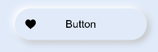  |  Button is slightly different with  just not text but also has a icon prefixed and a onclick event which is triggered when the button is clicked.List of properties are icon, width, height and border and icon is the property to be used. More info can be found <a href="https://gitee.com/openharmony-sig/Buttons">here.</a>
| <b><a href="https://gitee.com/openharmony-sig/Buttons">buttons </a></b>     | 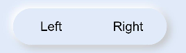  |Buttons is unique with slots on the left and right to add text, onclick event which is triggered when the button is clicked.List of properties are icon, width, height and slots be used. More info can be found <a href="https://gitee.com/openharmony-sig/Buttons">here.</a>
| <b><a href="https://gitee.com/openharmony-sig/Checkbox">checkbox </a> </b>    | 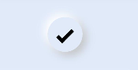  | Checkbox is the simple checkbox option with Neumorphism effect and  more info can be found <a href="https://gitee.com/openharmony-sig/Checkbox">here.</a>
| <b><a href="https://gitee.com/openharmony-sig/Dropdown">dropdown</a> </b>    | 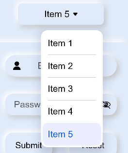  |Dropdown with Neumorphism effect with simple list items and  more info can be found <a href="https://gitee.com/openharmony-sig/Dropdown">here.</a>
| <b><a href= "https://gitee.com/openharmony-sig/Form">form </a>   </b>     | 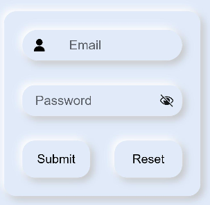  |Form with Neumorphism effect is a unique component with text fields which is the neuinput component and more info can be found <a href="https://gitee.com/openharmony-sig/Form">here.</a>
| <b><a href="https://gitee.com/openharmony-sig/Neumorphism/tree/master#input">input</a>  </b>      | 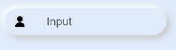  |Input with Neumorphism effect is a basic component for building forms with properties like type, maxlength and placeholder more info can be found <a href="https://gitee.com/openharmony-sig/Neumorphism/tree/master#input">here.</a> 
| <b><a href="https://gitee.com/openharmony-sig/Neumorphism/tree/master#label">label</a> </b>       | 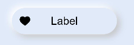  |Label can be used with Input in which you can add the icon and the text, more info can be found <a href="https://gitee.com/openharmony-sig/Neumorphism/tree/master#label">here.</a> 
| <b><a href="https://gitee.com/openharmony-sig/NavBar">navbar</a>  </b>     | 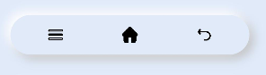  |Navbar is a very interesting  component that will help you to display 3 icon format with slots, more info can be found <a href="https://gitee.com/openharmony-sig/NavBar">here.</a> 
| <b><a href="https://gitee.com/openharmony-sig/pagination">pagination</a> </b>  | 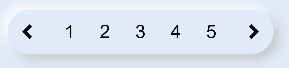  |Pagination with Neumorphism style and every page is a button , more info can be found <a href="https://gitee.com/openharmony-sig/pagination">here.</a>        
| <b><a href="https://gitee.com/openharmony-sig/progress">progress </a> </b>   | 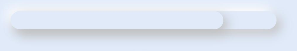  |Progress which indicates the progress of particular action item with progress properties and color can provided to highlight the indicator, more info can be found <a href="https://gitee.com/openharmony-sig/progress">here.</a> 
| <b><a href="https://gitee.com/openharmony-sig/Checkbox">radio  </a>  </b>    | 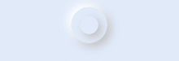  |Radio which is like checkbox simple as such in which you can perform two operation slike on or off, more info can be found <a href="https://gitee.com/openharmony-sig/Checkbox">here.</a>               
| <b><a href="https://gitee.com/openharmony-sig/Checkbox">switcher</a></b>     | 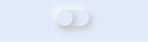  |Switcher is more like a switcher which is like you want to turn on or turn off actions, more info can be found <a href="https://gitee.com/openharmony-sig/Checkbox">here.</a>

<hr />


## **6. Installation**
Inorder to use Neumorphism Library for HarmonyOS follow the below set of instructions

Download & Install
```
npm i hmos-neumorphism
```
Details about OpenHarmony NPM environment configuration, see at[here](https://gitee.com/openharmony-tpc/docs/blob/master/OpenHarmony_npm_usage.md)

## **7. Usage**
```
Note :
Add this css snippet when passing input or button through slot .

button, input{
    width: 100%;
    height: 100%;
    background-color:transparent;
    color: black;
}
Import all components at once
<element name='neutheme' src='hmos-neumorphism/theme/theme.hml'></element>
<element name='neualert' src='hmos-neumorphism/alert/alert.hml'></element>
<element name='neuavatar' src='hmos-neumorphism/avatar/avatar.hml'></element>
<element name='neubutton' src='hmos-neumorphism/button/button.hml'></element>
<element name='neubuttons' src='hmos-neumorphism/buttons/buttons.hml'></element>
<element name='neucard' src='hmos-neumorphism/card/card.hml'></element>
<element name='neucheckbox' src='hmos-neumorphism/checkbox/checkbox.hml'></element>
<element name='neudropdown' src='hmos-neumorphism/dropdown/dropdown.hml'></element>
<element name='neuform' src='hmos-neumorphism/form/form.hml'></element>
<element name='neuinput' src='hmos-neumorphism/input/input.hml'></element>
<element name='neulabel' src='hmos-neumorphism/label/label.hml'></element>
<element name='neunavbar' src='hmos-neumorphism/navbar/navbar.hml'></element>
<element name='neupagination' src='hmos-neumorphism/pagination/pagination.hml'></element>
<element name='neuprogress' src='hmos-neumorphism/progress/progress.hml'></element>
<element name='neuradio' src='hmos-neumorphism/radio/radio.hml'></element>
<element name='neuswitcher' src='hmos-neumorphism/switcher/switcher.hml'></element>
<element name='neucarousel' src='hmos-neumorphism/carousel/carousel.hml'></element>
```

### **List of components supported by the library**
  

  
  
  

## **8. Examples**
In this section, we can have a look at some of the examples where the Components of this library is put to use and the results which we can acheive.

**Example1: Smart Watch**  

<h3>Smart Watch</h3>
<p> The complete uses cases code can be found <a href="https://gitee.com/openharmony-sig/Neumorphism_Smart_Watch">here.</a></p>
<p> The below uses cases is a simple Smartwatch implemented using the Neumorphism library and every component displayed in the smartwatch are the neumorphic component like listed below.</p>
<ul>
  <li>neutheme</li>
  <li>neubutton</li>
  <li>neucard </li>
 </ul>
<br/>
<br/>
<p float="left" >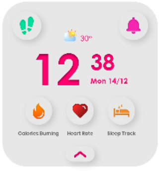   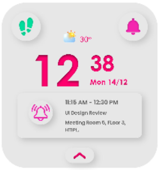</p>

<p> In order to display a simple card with title, subject and  message, below is the code snippet used. </p>

Usage:
```html
<neucard if="{{notifications}}" class="footer">
            <neubutton class="footer_icon">
                <image src="common/images/snooze.png"></image>
            </neubutton>
            <div class="footer_info semi_bold dark_text">
                <div class="footer_title">
                    <text>{{notification_title}}</text>
                </div>
                <div class="footer_subject">
                    <text>{{notification_subject}}</text>
                </div>
                <div class="message">
                    <text>{{notification_message}}</text>
                </div>
            </div>
        </neucard>
```

<p>With the above snippet we can get the below design.</p>
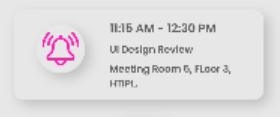
 <hr/>

**Example2: Smart Home Dark and Light Theme**  
<h3>Smart Home Dark and Light Theme</h3>
<p> The complete uses case code can be found <a href="https://gitee.com/openharmony-sig/Neumorphism_Smarthome_Darkmode">here.</a></p>
<p> The below uses case is a simple Living Room Design in <a href="https://gitee.com/openharmony-sig/Neumorphism_Smarthome_Darkmode">Dark mode </a> and <a href="https://gitee.com/openharmony-sig/Neumorphism_Smarthome_Lightmode">Light mode</a> and it is implemented using the Neumorphism library and every component displayed in the Living Room are the neumorphic component like listed below.</p>
<ul>
  <li>neutheme</li>
  <li>neucard </li>
  <li>swiper  </li>
 </ul>
<br/>
<br/>
<p float="left" >
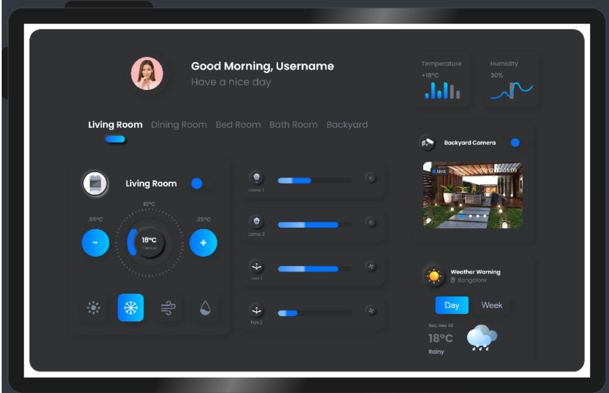&nbsp;&nbsp;&nbsp;&nbsp;&nbsp;&nbsp;&nbsp;&nbsp;&nbsp;&nbsp;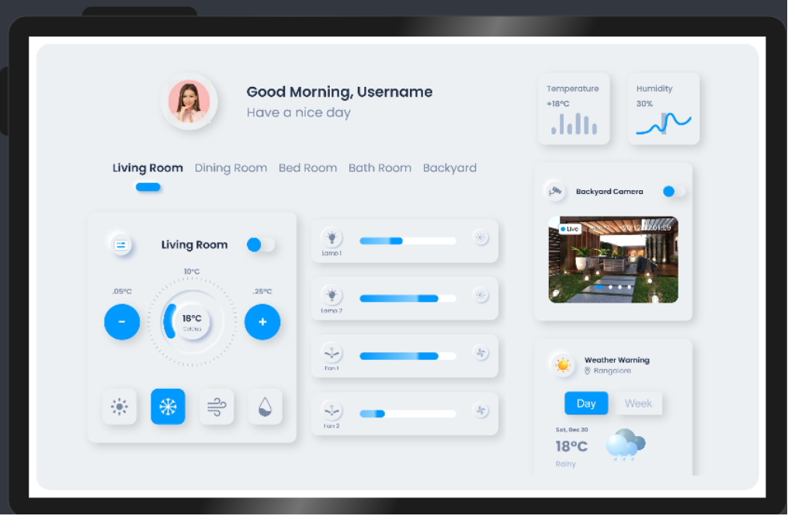</p>
<p> In order to display a simple ring progress bar with plus and minus icons to increase the temperature, below is the code snippet used. </p>

Usage:
```html
 <div class="controller">
                            <div class="minus semi_bold light_text">
                                <text>.05&deg;C</text>
                                <neubutton class="minus_button theme_bg" @button-event="decreaseTemp">
                                        <text>-</text>
                                </neubutton>
                            </div>
                            <div class="level semi_bold light_text">
                                <text>10&deg;C</text>
                                <div class="range">
                                    <div class="curve_bg">
                                        <div class="progress">
                                            <progress class="progress_bar theme_text" type="ring" percent="{{(temperature-15)*6}}"></progress>
                                            <div class="progress_value">
                                                <div class="progress_value_header semi_bold dark_text">
                                                    <text>{{temperature}}&deg;C</text>
                                                </div>
                                                <div class="progress_value_footer regular light_text">
                                                    <text>Celcius</text>
                                                </div>
                                            </div>
                                        </div>
                                    </div>
                                </div>
                            </div>
                            <div class="plus semi_bold light_text">
                                <text>.25&deg;C</text>
                                <neubutton class="plus_button theme_bg" @button-event="increaseTemp">
                                        <text>+</text>
                                </neubutton>
                            </div>
                        </div>
```

<p>With the above snippet we can get the below design.</p>
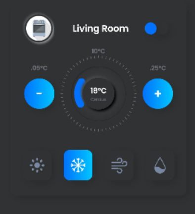
 <hr/>
 
**Example3: Smart Home Dark and Light Theme**  
<h3>Smart Home Light and Dark Theme Phone Mode</h3>
<p> The complete use case code can be found <a href="https://gitee.com/openharmony-sig/Neumorphism_Living-Room_Design">here.</a></p>
<p> Like the above Living room design we have the same Design in phone mode for <a href="https://gitee.com/openharmony-sig/Neumorphism_Living-Room_Design"> Light mode </a> and <a href="https://gitee.com/openharmony-sig/Neumorphism_Living-Room_Design">Dark Mode</a> and it is implemented using the Neumorphism library and every component displayed in the Living Room are the neumorphic components.</p>
<br/>
<br/>
  <p float="left" >
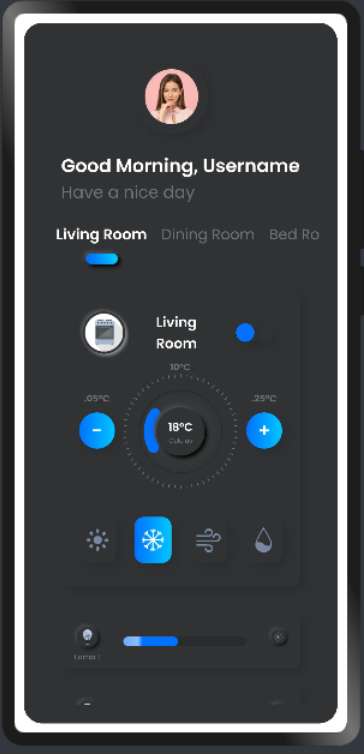&nbsp;&nbsp;&nbsp;&nbsp;&nbsp;&nbsp;&nbsp;&nbsp;&nbsp;&nbsp;&nbsp;&nbsp;&nbsp;&nbsp;&nbsp;&nbsp;&nbsp;&nbsp;&nbsp;&nbsp;&nbsp;&nbsp;&nbsp;&nbsp;&nbsp;
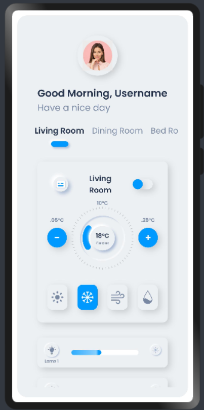
</p>
<hr />    
  
## **9. Conclusion**
Okio is a very easy to use and very powerful library.The performance of the library is very good even when it works on one of the latest operating systems in the world, which is HarmonyOS!

* For more exciting libraries to develop your app, peep into third-party-components at </br>
[OpenHarmony-TPC](https://gitee.com/openharmony-tpc)

* To know more about the developement work happening on harmony aaplication layer, and even be part of the exciting stuff, watch this space of [Application Library Engineering Group](https://github.com/applibgroup)
