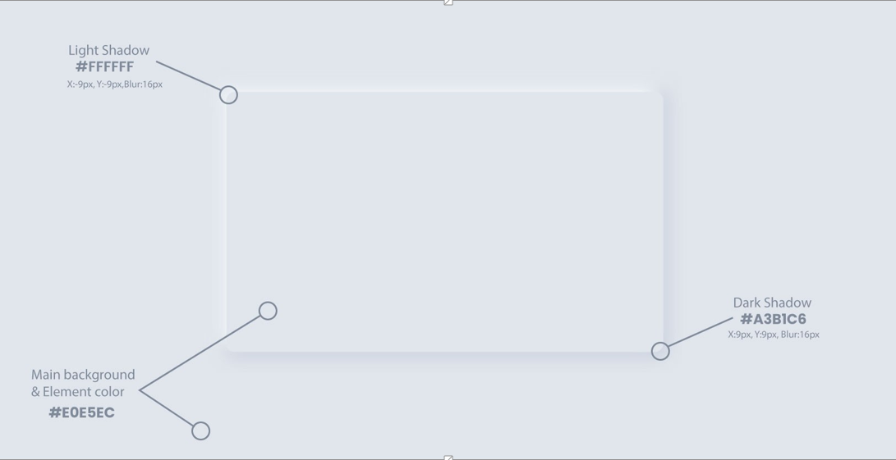
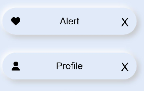
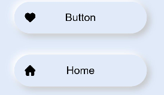
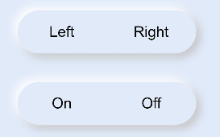
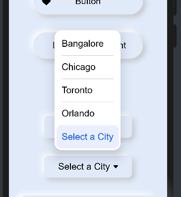
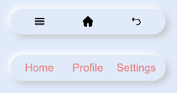
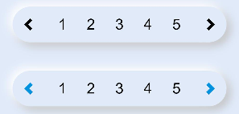
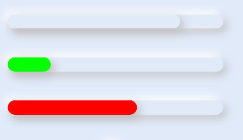
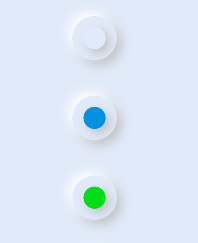
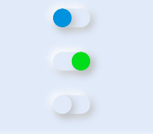

# How to use Neumorphism Library for HarmonyOS: A developer’s Guide

## **1. Introduction**
Neumorphism (aka neomorphism) is a relatively new design trend and a term that's gotten a good amount of buzz lately.
It derives its name from skeuomorphism – a way of integrating real-world objects into user interface design.
Well in order to understand Neumorphism let's understand what is Skeuomorphism and flat designs first.</br>
<span style="color: purple;">Neumorphism</span> is a library draws from both skeuomorphism and flat design by pairing a monochromatic color palette with subtle shadows, while giving a sense of 3-dimensions in the form of buttons and other elements.

To get started right away, head on to [Gitee](https://gitee.com/openharmony-sig/Neumorphism)

## **2. How to achieve Neumorphism?**
 There are certail design principles to be followed inorder to achieve neumorphism and I have listed it below.
 <ul><li>Light Color for Light Shadow.</li>
 <li>Mid color for Main background and Element color.</li>
 <li>Dark Color for Dark Shadow.</li></ul>
 <br />
 <p>A pictorical representation in achieving Neumorphism.</p>
 <br />
 
 <p> The Neumorphic effect can be achieved by playing with the two shades as mentioned in the above images. Using the varying the positive and negative values we can achieve the depth and the dart shadows.</p>

## **3. Benefits**
<ul>
  <li>It adds 3D feel for real buttons and Visual Freshness.</li>
  <li>Overloaded interfaces are bypassed by users.</li>
  <li>Neumorphism designs remain a timeless classic.</li>
  <li>It accelerates the process of conceptualizing, building, testing, and iterating new screens.</li>
</ul>
<br/>
<p> This is the library reference <a href = "https://gitee.com/openharmony-sig/Neumorphism">Here</a> </p>

## **4. Typical Use Cases**
The library <span style="color: purple;">Neomorphism</span>, can be implemented in most of the common used application component to achieve the neumorphic effect.
Below are some of the examples to be highlighted.

<div align="center">
<table>
    <tr>
        <td>
            <ul><li>Simple Smartwatch</li><ul>
        </td>
        <td>
            <ul><li>Smart Home Dark and Light Theme</li><ul>
        </td>
    </tr>
    <tr>
        <td width="50%"><p align="center"></p></td>
        <td width="100%"><p align="center"></p></td>
    </tr>
</table>
</div>

## **5. List of Features**
This section highlights the list of components created with Neumorphic effect that is available and supported.
  
| Components   | Display                                            |Description |
| -------------| -------------                                      |------------- |
| <b><a href ="https://gitee.com/openharmony-sig/Card">avatar</a></b>       |  &nbsp;&nbsp;&nbsp;&nbsp;&nbsp;&nbsp;&nbsp;&nbsp;&nbsp;&nbsp;&nbsp;&nbsp;&nbsp;&nbsp;&nbsp;&nbsp;&nbsp;&nbsp;&nbsp;&nbsp;&nbsp;&nbsp;&nbsp;&nbsp;&nbsp;&nbsp;&nbsp;&nbsp;&nbsp;&nbsp;&nbsp;&nbsp;&nbsp;&nbsp;&nbsp;&nbsp;&nbsp;&nbsp;&nbsp;&nbsp;&nbsp;&nbsp;&nbsp;&nbsp;&nbsp;&nbsp;&nbsp;&nbsp;  | Avatar is used to display the profile image with Neumorphism effect. We have access to the listed properties like icon, width, height and border and icon is the property used to add the image. More info can be found <a href="https://gitee.com/openharmony-sig/Card">here.</a>
| <b><a href="https://gitee.com/openharmony-sig/Buttons">button </a> </b>     |   |  Button is slightly different with  just not text but also has a icon prefixed and a onclick event which is triggered when the button is clicked.List of properties are icon, width, height and border and icon is the property to be used. More info can be found <a href="https://gitee.com/openharmony-sig/Buttons">here.</a>
| <b><a href="https://gitee.com/openharmony-sig/Buttons">buttons </a></b>     |   |Buttons is unique with slots on the left and right to add text, onclick event which is triggered when the button is clicked.List of properties are icon, width, height and slots be used. More info can be found <a href="https://gitee.com/openharmony-sig/Buttons">here.</a>
| <b><a href="https://gitee.com/openharmony-sig/Checkbox">checkbox </a> </b>    |   | Checkbox is the simple checkbox option with Neumorphism effect and  more info can be found <a href="https://gitee.com/openharmony-sig/Checkbox">here.</a>
| <b><a href="https://gitee.com/openharmony-sig/Dropdown">dropdown</a> </b>    |   |Dropdown with Neumorphism effect with simple list items and  more info can be found <a href="https://gitee.com/openharmony-sig/Dropdown">here.</a>
| <b><a href= "https://gitee.com/openharmony-sig/Form">form </a>   </b>     |   |Form with Neumorphism effect is a unique component with text fields which is the neuinput component and more info can be found <a href="https://gitee.com/openharmony-sig/Form">here.</a>
| <b><a href="https://gitee.com/openharmony-sig/Neumorphism/tree/master#input">input</a>  </b>      |   |Input with Neumorphism effect is a basic component for building forms with properties like type, maxlength and placeholder more info can be found <a href="https://gitee.com/openharmony-sig/Neumorphism/tree/master#input">here.</a> 
| <b><a href="https://gitee.com/openharmony-sig/Neumorphism/tree/master#label">label</a> </b>       |   |Label can be used with Input in which you can add the icon and the text, more info can be found <a href="https://gitee.com/openharmony-sig/Neumorphism/tree/master#label">here.</a> 
| <b><a href="https://gitee.com/openharmony-sig/NavBar">navbar</a>  </b>     |   |Navbar is a very interesting  component that will help you to display 3 icon format with slots, more info can be found <a href="https://gitee.com/openharmony-sig/NavBar">here.</a> 
| <b><a href="https://gitee.com/openharmony-sig/pagination">pagination</a> </b>  |   |Pagination with Neumorphism style and every page is a button , more info can be found <a href="https://gitee.com/openharmony-sig/pagination">here.</a>        
| <b><a href="https://gitee.com/openharmony-sig/progress">progress </a> </b>   |   |Progress which indicates the progress of particular action item with progress properties and color can provided to highlight the indicator, more info can be found <a href="https://gitee.com/openharmony-sig/progress">here.</a> 
| <b><a href="https://gitee.com/openharmony-sig/Checkbox">radio  </a>  </b>    |   |Radio which is like checkbox simple as such in which you can perform two operation slike on or off, more info can be found <a href="https://gitee.com/openharmony-sig/Checkbox">here.</a>               
| <b><a href="https://gitee.com/openharmony-sig/Checkbox">switcher</a></b>     |   |Switcher is more like a switcher which is like you want to turn on or turn off actions, more info can be found <a href="https://gitee.com/openharmony-sig/Checkbox">here.</a>

<hr />


## **6. Installation**
In order to use Neumorphism Library for HarmonyOS follow the below set of instructions

Download & Install
```
npm i hmos-neumorphism
```
Details about Open Harmony NPM environment configuration, see at[here](https://gitee.com/openharmony-tpc/docs/blob/master/OpenHarmony_npm_usage.md)

## **7. Usage**
```
Note :
Add this css snippet when passing input or button through slot .

button, input{
    width: 100%;
    height: 100%;
    background-color:transparent;
    color: black;
}
Import all components at once
<element name='neutheme' src='hmos-neumorphism/theme/theme.hml'></element>
<element name='neualert' src='hmos-neumorphism/alert/alert.hml'></element>
<element name='neuavatar' src='hmos-neumorphism/avatar/avatar.hml'></element>
<element name='neubutton' src='hmos-neumorphism/button/button.hml'></element>
<element name='neubuttons' src='hmos-neumorphism/buttons/buttons.hml'></element>
<element name='neucard' src='hmos-neumorphism/card/card.hml'></element>
<element name='neucheckbox' src='hmos-neumorphism/checkbox/checkbox.hml'></element>
<element name='neudropdown' src='hmos-neumorphism/dropdown/dropdown.hml'></element>
<element name='neuform' src='hmos-neumorphism/form/form.hml'></element>
<element name='neuinput' src='hmos-neumorphism/input/input.hml'></element>
<element name='neulabel' src='hmos-neumorphism/label/label.hml'></element>
<element name='neunavbar' src='hmos-neumorphism/navbar/navbar.hml'></element>
<element name='neupagination' src='hmos-neumorphism/pagination/pagination.hml'></element>
<element name='neuprogress' src='hmos-neumorphism/progress/progress.hml'></element>
<element name='neuradio' src='hmos-neumorphism/radio/radio.hml'></element>
<element name='neuswitcher' src='hmos-neumorphism/switcher/switcher.hml'></element>
<element name='neucarousel' src='hmos-neumorphism/carousel/carousel.hml'></element>
```

## **8.List of components supported by the library and there detailed implementation and usage with customization.**
  
# Alert
Alert components use to notify user of information
Let's see how to create the alert component in HarmonyOS.

1. Import: the node component and you can refer that from library <a href ="https://gitee.com/openharmony-sig/Alert"> here </a> as shown below. 

```html
<element name='neualert' src='hmos-neumorphism/alert/alert.hml'></element>
```
2. Now we need use the tag named "neualert" and define the parameters like icon and Text as shown below.
  
Usage:
```html
<neualert icon="common/icons/heart.png" width="300px" height="60px" border="40px" >
     <text>Alert</text>
</neualert>
<neualert icon="common/icons/user.png" width="300px" height="60px" border="40px" >
     <text>Profile</text>
</neualert>
```
 Below are list of properties available.
 | Properties   | Description |
 | -------------| ------------|
 | `icon`      |   Icon represent the image which is placed in the left corner of the alert box.           |
 | `width, height` |    Defines the height and width of the alert box.       |
 | `border`|    Defines the border of the alert box.               |
 |           |                 |
 
That's it by doing this we will get the below Neumorphic alert design and some variations.


<hr>
# Avatar
Avatar components use to notify user of information

Let's see how to create the Avatar component in HarmonyOS.

1. Import: the node component and you can refer that from library <a href ="https://gitee.com/openharmony-sig/Card"> here </a> as shown below. 

```html
<element name='neuavatar' src='hmos-neumorphism/avatar/avatar.hml'></element>
```

2. Now we need use the tag named "neuavatar" and define the parameters like icon shown below.
  
Usage:
```html
<neuavatar icon="common/icons/user.png" width="100px" height="100px" border="50px"></neuavatar>
```
Below are list of properties available.
 | Properties   | Description |
 | -------------| ------------|
 | `icon`      |   Icon represent the image which is placed in the Center of the Avatar box.           |
 | `width, height` |    Defines the height and width of the Avatar box.       |
 | `border`|    Defines the border of the Avatar box.               |
 |           |                 |
  
That's it by doing this we will get the below Neumorphic avatar design.


<hr>

# Button
Button components use to notify user of information

Let's see how to create the button component in HarmonyOS.

1. Import: the node component and you can refer that from library <a href ="https://gitee.com/openharmony-sig/Buttons"> here </a> as shown below. 

```html
<element name='neubutton' src='hmos-neumorphism/buttons/button.hml'></element>
```

2. Now we need use the tag named "neubutton" and define the parameters like icon and Text as shown below.
  
Usage:
```html
<neubutton icon="common/icons/heart.png" width="250px" height="60px" border="50px" onclick="buttonClick">
    <text>Button</text>
</neubutton>

<neubutton icon="common/icons/home.png" width="250px" height="60px" border="50px" onclick="buttonClick">
    <text>Home</text>
</neubutton>
```
Below are list of properties available.
 | Properties   | Description |
 | -------------| ------------|
 | `icon`      |   Icon represent the image which is placed in the left corner of the button.           |
 | `width, height` |    Defines the height and width of the Button box.       |
 | `border`|    Defines the border of the button box.               |
 | `button-event` | When clicked on the button we need to define the action here.                |

That's it by doing this we will get the below Neumorphic Button design.


<hr>

# Buttons
Buttons components use to notify user of information

Let's see how to create the buttons component in HarmonyOS.

1. Import: the node component and you can refer that from library <a href ="https://gitee.com/openharmony-sig/Buttons"> here </a> as shown below. 

```html
<element name='neubuttons' src='hmos-neumorphism/buttons/buttons.hml'></element>
```

2. Now we need use the tag named "neubuttons" and define the parameters like slots and onclick as shown below.
  
Usage:
```html
<neubuttons  width="250px" height="60px" border="50px">
    <button slot="first">Left</button>
    <button slot="second">Right</button>
</neubuttons>

<neubuttons  width="250px" height="60px" border="50px">
    <button slot="first">On</button>
    <button slot="second">Off</button>
</neubuttons>
```
Below are list of properties available.
 | Properties   | Description |
 | -------------| ------------|
 | `width, height` |    Defines the height and width of the Buttons box.       |
 | `border`|    Defines the border of the buttons box.               |
 | `onclick` | When clicked on the button we need to define the action here.                |
 | `slot` | Slot with class ="first" ensure the content is added to the left and class ="second" the content is added to the Right                |

That's it by doing this we will get the below Neumorphic buttons design.


<hr>

# Card
Now let's how to implement a card design.

1. Import: the node component and you can refer that from library <a href ="https://gitee.com/openharmony-sig/Card"> here </a> as shown below. 

Import:
```html
<element name='neucard' src='hmos-neumorphism/avatar/avatar.hml'></element>
```

2. Now we need use the tag named "neucard" and define the parameters like height, width and border as shown below and the image to display inside the card, you can replace it with text as well.
  
Usage:
```html
<neucard width="300px" height="200px" border="10px" >
  <image src="common/placeholder.png" ></image>
</neucard>
```
Below are list of properties available.
 | Properties   | Description |
 | -------------| ------------|
 | `width, height` |    Defines the height and width of the Card.       |
 | `border`|    Defines the border of the card.               |
 | `image` | Image defines the placeholder image. |

  
That's it by doing this we will get the below Neumorphic card design.


<hr/>

# Checkbox
Checkbox components use to notify user of information

Let's see how to create the checkbox component in HarmonyOS.

1. Import: the node component and you can refer that from library <a href ="https://gitee.com/openharmony-sig/Checkbox"> here </a> as shown below. 

```html
<element name='neucheckbox' src='hmos-neumorphism/checkbox/checkbox.hml'></element>
```

2. Now we need use the tag named "neucheckbox" and define the parameters like color, width, height, check-event as shown below.
  
Usage:
```html
<neucheckbox color="#0092df" width="50px" height="50px" border="50px" checked="true" @check-event="checkboxClick"></neucheckbox>
<neucheckbox color="#00dd19" width="50px" height="50px" border="50px" checked="true" @check-event="checkboxClick"></neucheckbox>
```
Below are list of properties available.
 | Properties   | Description |
 | -------------| ------------|
 | `color` |    Defines the color of the Checkbox.       |
 | `width, height` |    Defines the height and width of the checkbox box.       |
 | `checked` |    This property defines if the checkbox needs to be checked or not, if true it is checked and false makes it unchecked.      |
 | `check-event`|    When clicked on the checkbox we need to define the action here.               |
  
That's it by doing this we will get the below Neumorphic checkbox design.


<hr>

# Dropdown
Dropdown components use to notify user of information

Let's see how to create the dropdown component in HarmonyOS.

1. Import: the node component and you can refer that from library <a href ="https://gitee.com/openharmony-sig/Dropdown/"> here </a> as shown below. 

```html
<element name='neudropdown' src='hmos-neumorphism/dropdown/dropdown.hml'></element>
```
2. Now we need use the tag named "neudropdown" and define the parameters like change-event option value as shown below.
  
Usage:
```html
<neudropdown width="200px" height="50px" border="10px" @change-event="dropdownSelect">
      <select @change="dropdownSelect">
          <option value="Item 1">Item 1</option>
          <option value="Item 2">Item 2</option>
          <option value="Item 3">Item 3</option>
          <option value="Item 4">Item 4</option>
          <option value="Item 5" selected="true">Item 5</option>
      </select>
  </neudropdown>

  <neudropdown width="200px" height="50px" border="10px" @change-event="dropdownSelect">
      <select @change="dropdownSelect">
          <option value="Item 1">Bangalore</option>
          <option value="Item 2">Chicago</option>
          <option value="Item 3">Toronto</option>
          <option value="Item 4">Orlando</option>
          <option value="Item 5" selected="true">Select a City</option>
      </select>
  </neudropdown>
```
Below are list of properties available.
 | Properties   | Description |
 | -------------| ------------|
 | `width, height` |    Defines the height and width of the Dropdown box.       |
 | `selected` |    This property defines which item of the dropdown item to be displayed as default in the dropdown, true and false are the values that can be set. |
 | `change-event`|    when clicked on the checkbox we need to define the action here.               |
  
That's it by doing this we will get the below Neumorphic dropdown design.

&nbsp;&nbsp;&nbsp;&nbsp;&nbsp;&nbsp;&nbsp;&nbsp;&nbsp;
<hr>

# Form
Form components use to notify user of information

Let's see how to create the form component in HarmonyOS.

1. Import: the node component and you can refer that from library <a href ="https://gitee.com/openharmony-sig/Form"> here </a> as shown below. 

```html
<element name='neuform' src='hmos-neumorphism/form/form.hml'></element>
```
2. Now we need use the tag named "neuform" and define the parameters like neuinput,neubutton, input type and so on as shown below.
  
Usage:
```html
<neuform width="350px" height="300px" border="20px" @submit-event="buttonClick" @reset-event="buttonClick">
 <neuinput icon="common/icons/user.png" type="email" maxlength="20" placeholder="Email" border="30px"></neuinput>
 <neuinput icon="" type="password" maxlength="20" placeholder="Password" border="20px"></neuinput>
 <div>
  <neubutton icon="" width="150px" border="20px">
   <input type='submit' style="border-radius:20px;">Submit</input>
  </neubutton>
  <neubutton icon="" width="150px" border="20px">
   <input type='reset' style="border-radius:20px;">Reset</input>
  </neubutton>
 </div>
</neuform>
```
Below are list of properties available.
| Properties   | Description |
 | -------------| ------------|
 | `width, height` |    Defines the height and width of the Form box.       |
 | `submit-event` |    The form contains the submit button, and the action related to submit event is defined here.|
 | `reset-event`|    The form contains the reset button, and the action related to reset event is defined here.|
  
That's it by doing this we will get the below Neumorphic form design.


<hr>

# Input
Input components use to notify user of information

Let's see how to create the input component in HarmonyOS.

1. Import: the node component and you can refer that from library <a href ="https://gitee.com/openharmony-sig/Neumorphism/tree/master#input"> here </a> as shown below. 

```html
<element name='neualert' src='hmos-neumorphism/input/input.hml'></element>
```
2. Now we need use the tag named "neualert" and define the parameters like icon, type, placeholder as shown below.
  
Usage:
```html
<neuinput icon="common/icons/user.png" type="text" maxlength="20" placeholder="Input" width="300px" height="50px" border="50px" ></neuinput>
```
Below are list of properties available.
 | Properties   | Description |
 | -------------| ------------|
 | `icon` |    Defines the icon for the input form and placed on the left corner.       |
 | `type` |    The type property defines the type of data accepted in the input form|
 | `maxlength`|   This property defines the maxlength that you can input in the field|
 | `placeholder`|   This property defines the field is input.|
 | `width, height`|   This property defines the width and height of the input field.|
 | `border`|   This property defines the border of the input field.|

  
That's it by doing this we will get the below Neumorphic input design.


<hr>
# Label
Label components use to notify user of information

Let's see how to create the label component in HarmonyOS.

1. Import: the node component and you can refer that from library <a href ="https://gitee.com/openharmony-sig/Neumorphism/tree/master#label"> here </a> as shown below. 

```html
<element name='neulabel' src='hmos-neumorphism/label/label.hml'></element>
```

2. Now we need use the tag named "neulabel" and define the parameters like icon and text as shown below.
  
Usage:
```html
<neulabel text="Label" icon="common/icons/heart.png" width="200px" height="50px" border="50px" ></neulabel>

```
Below are list of properties available.
 | Properties   | Description |
 | -------------| ------------|
 | `icon` |    Defines the icon for the label and placed on the left corner.       |
 | `text` |    This property defines the field is label.|
 | `width, height`|   This property defines the width and height of the label field.|
 | `border`|   This property defines the border of the label field.|
  
That's it by doing this we will get the below Neumorphic label design.


<hr>

# Navbar
Navbar components use to notify user of information

Let's see how to create the navbar component in HarmonyOS.

1. Import: the node component and you can refer that from library <a href ="https://gitee.com/openharmony-sig/Neumorphism/tree/master#navbar"> here </a> as shown below. 

```html
<element name='neunavbar' src='hmos-neumorphism/navbar/navbar.hml'></element>
```

2. Now we need use the tag named "neunavbar" and define the parameters like image and text as shown below.
  
Usage:
```html
<neulabel text="Label" icon="common/icons/heart.png" width="200px" height="50px" border="50px" ></neulabel>

  <neunavbar  width="300px" height="50px" border="50px" @right-event="buttonClick" @middle-event="buttonClick" @left-event="buttonClick">
      <image slot="first" src="common/icons/recent.png" style="width:20px; height: 20px;" ></image>
      <image slot="second" src="common/icons/home.png" style="width:20px; height: 20px;" ></image>
      <image slot="third" src="common/icons/return.png" style="width:20px; height: 20px;" ></image>
  </neunavbar>

  <neunavbar  width="300px" height="50px" border="50px" @right-event="buttonClick" @middle-event="buttonClick" @left-event="buttonClick">
      <text slot="first" style="color: #ea7979;" >Home</text>
      <text slot="second" style="color: #ea7979;" >Profile</text>
      <text slot="third" style="color: #ea7979;" >Settings</text>
  </neunavbar>

```
Below are list of properties available.
 | Properties   | Description |
 | -------------| ------------|
 | `width, height`|   This property defines the width and height of the Navbar.|
 | `right-event`|   This property defines the action item placed on the right of the navigation.|
 | `middle-event`|   This property defines the action item placed on the middle of the navigation.|
 | `left-event`|   This property defines the action item placed on the left of the navigation.|
 | `slot`|   This property defines the position of the icon, slot="first", the image is placed in left, slot="second", the image is placed in middle, slot="third", the image is placed in right.|
 
That's it by doing this we will get the below Neumorphic navbar design.


<hr>

# Pagination
Pagination components use to notify user of information

Let's see how to create the pagination component in HarmonyOS.

1. Import: the node component and you can refer that from library <a href ="https://gitee.com/openharmony-sig/Neumorphism/tree/master#pagination"> here </a> as shown below. 

```html
<element name='neupagination' src='hmos-neumorphism/pagination/pagination.hml'></element>
```
2. Now we need use the tag named "neupagination" and define the parameters like color,next-event and previous-event as shown below.
  
Usage:
```html
<neupagination color="" width="300px" height="50px" border="50px"  @previous-event="previousEvent" @next-event="nextEvent">
    <button>1</button>
    <button>2</button>
    <button>3</button>
    <button>4</button>
    <button>5</button>
</neupagination>

<neupagination color="#0092df" width="300px" height="50px" border="50px"  @previous-event="previousEvent" @next-event="nextEvent">
    <button>1</button>
    <button>2</button>
    <button>3</button>
    <button>4</button>
    <button>5</button>
</neupagination>
```
Below are list of properties available.
 | Properties   | Description |
 | -------------| ------------|
 | `color`|   This property defines the color of the arrow in the pagination|
 | `width, height`|   This property defines the width and height of the pagination.|
 | `border`|   This property defines the border of the pagination.|
 | `previous-event`|   This property defines the action item placed on the left arrow of the pagination.|
 | `next-event`|    This property defines the action item placed on the right arrow of the pagination.|
  
That's it by doing this we will get the below Neumorphic pagination design.


<hr>

# Progress
Progress components use to notify user of information

Let's see how to create the Progress component in HarmonyOS.

1. Import: the node component and you can refer that from library <a href ="https://gitee.com/openharmony-sig/progress"> here </a> as shown below. 

```html
<element name='neuprogress' src='hmos-neumorphism/progress/progress.hml'></element>
```
2. Now we need use the tag named "neuprogress" and define the parameters like progress value as shown below.
  
Usage:
```html
    <neuprogress progress="80%" width="300px" color="" height="20px" border="50px"></neuprogress>
    <neuprogress progress="20%" width="300px" color="#04ff00" height="20px" border="50px"></neuprogress>
    <neuprogress progress="60%" width="300px" color="#ff0000" height="20px" border="50px"></neuprogress>
```
Below are list of properties available.
 | Properties   | Description |
 | -------------| ------------|
 | `color`|   This property defines the color of the progress.|
 | `width, height`|   This property defines the width and height of the progress.|
 | `border`|   This property defines the border of the progress.|
 | `progress`|   This property defines the value of the progress value in percent.|

  
That's it by doing this we will get the below Neumorphic Progress design.


<hr>

# Radio
Radio components use to notify user of information

Let's see how to create the radio component in HarmonyOS.

1. Import: the node component and you can refer that from library <a href ="https://gitee.com/openharmony-sig/Neumorphism/tree/master#radio"> here </a> as shown below. 

```html
<element name='neuradio' src='hmos-neumorphism/radio/radio.hml'></element>
```

2. Now we need use the tag named "neuradio" and define the parameters like color, width and check-event as shown below.
  
Usage:
```html
    <neuradio width="50px" color="" height="50px" border="50px" checked="true" @check-event="radioClick"></neuradio>
    <neuradio width="50px" color="#0092df" height="50px" border="50px" checked="true" @check-event="radioClick"></neuradio>
    <neuradio width="50px" color="#00dd19" height="50px" border="50px" checked="true" @check-event="radioClick"></neuradio>
```
Below are list of properties available.
 | Properties   | Description |
 | -------------| ------------|
 | `color` |    Defines the color of the Radio.       |
 | `width, height` |    Defines the height and width of the Radio box.       |
 | `checked` |    This property defines if the radio needs to be checked or not, if true it is checked and false makes it unchecked.      |
 | `check-event`|    When clicked on the radio we need to define the action here.               |
  
That's it by doing this we will get the below Neumorphic radio design.


<hr>

# Switcher
Switcher components use to notify user of information

Let's see how to create the Switcher component in HarmonyOS.

1. Import: the node component and you can refer that from library <a href ="https://gitee.com/openharmony-sig/Neumorphism/tree/master#switcher"> here </a> as shown below. 

```html
<element name='neuswitcher' src='hmos-neumorphism/switcher/switcher.hml'></element>
```
2. Now we need use the tag named "neumorph_switcher" and define the parameters like color, toggle, toggle-event as shown below.
  
Usage:
```html
    <neuswitcher width="60px" color="#0092df" height="30px" border="50px" toggle="off" @toggle-event="toggleClick"></neuswitcher>
    <neuswitcher width="60px" color="#00dd19" height="30px" border="50px" toggle="on" @toggle-event="toggleClick"></neuswitcher>
    <neuswitcher width="60px" color="" height="30px" border="50px" toggle="off" @toggle-event="toggleClick"></neuswitcher>
```
Below are list of properties available.
 | Properties   | Description |
 | -------------| ------------|
 | `color` |    Defines the color of the Switcher.       |
 | `width, height` |    Defines the height and width of the Switcher box.       |
 | `toggle` |    This property defines if the Switcher needs to be checked or not, if true it is checked and false makes it unchecked.      |
 | `toggle-event`|    When clicked on the Switcher we need to define the action here.               |
  

That's it by doing this we will get the below Neumorphic Switcher design.


<hr>

## **9. Examples**
In this section, we can have a look at some of the examples where the Components of this library is put to use and the results which we can acheive.

**Example1: Smart Watch**  

<h3>Smart Watch</h3>
<p> The complete uses cases code can be found <a href="https://gitee.com/openharmony-sig/Neumorphism_Smart_Watch">here.</a></p>
<p> The below uses cases is a simple Smartwatch implemented using the Neumorphism library and every component displayed in the smartwatch are the neumorphic component like listed below.</p>
<ul>
  <li>neutheme</li>
  <li>neubutton</li>
  <li>neucard </li>
 </ul>
<br/>
<br/>
<p float="left" >   </p>

<p> In order to display a simple card with title, subject and  message, below is the code snippet used. </p>

Usage:
```html
<neucard if="{{notifications}}" class="footer">
            <neubutton class="footer_icon">
                <image src="common/images/snooze.png"></image>
            </neubutton>
            <div class="footer_info semi_bold dark_text">
                <div class="footer_title">
                    <text>{{notification_title}}</text>
                </div>
                <div class="footer_subject">
                    <text>{{notification_subject}}</text>
                </div>
                <div class="message">
                    <text>{{notification_message}}</text>
                </div>
            </div>
        </neucard>
```

<p>With the above snippet we can get the below design.</p>

 <hr/>

**Example2: Smart Home Dark and Light Theme**  
<h3>Smart Home Dark and Light Theme</h3>
<p> The complete uses case code can be found <a href="https://gitee.com/openharmony-sig/Neumorphism_Smarthome_Darkmode">here.</a></p>
<p> The below uses case is a simple Living Room Design in <a href="https://gitee.com/openharmony-sig/Neumorphism_Smarthome_Darkmode">Dark mode </a> and <a href="https://gitee.com/openharmony-sig/Neumorphism_Smarthome_Lightmode">Light mode</a> and it is implemented using the Neumorphism library and every component displayed in the Living Room are the neumorphic component like listed below.</p>
<ul>
  <li>neutheme</li>
  <li>neucard </li>
  <li>swiper  </li>
 </ul>
<br/>
<br/>
<p float="left" >
&nbsp;&nbsp;&nbsp;&nbsp;&nbsp;&nbsp;&nbsp;&nbsp;&nbsp;&nbsp;</p>
<p> In order to display a simple ring progress bar with plus and minus icons to increase the temperature, below is the code snippet used. </p>

Usage:
```html
 <div class="controller">
                            <div class="minus semi_bold light_text">
                                <text>.05&deg;C</text>
                                <neubutton class="minus_button theme_bg" @button-event="decreaseTemp">
                                        <text>-</text>
                                </neubutton>
                            </div>
                            <div class="level semi_bold light_text">
                                <text>10&deg;C</text>
                                <div class="range">
                                    <div class="curve_bg">
                                        <div class="progress">
                                            <progress class="progress_bar theme_text" type="ring" percent="{{(temperature-15)*6}}"></progress>
                                            <div class="progress_value">
                                                <div class="progress_value_header semi_bold dark_text">
                                                    <text>{{temperature}}&deg;C</text>
                                                </div>
                                                <div class="progress_value_footer regular light_text">
                                                    <text>Celcius</text>
                                                </div>
                                            </div>
                                        </div>
                                    </div>
                                </div>
                            </div>
                            <div class="plus semi_bold light_text">
                                <text>.25&deg;C</text>
                                <neubutton class="plus_button theme_bg" @button-event="increaseTemp">
                                        <text>+</text>
                                </neubutton>
                            </div>
                        </div>
```

<p>With the above snippet we can get the below design.</p>

 <hr/>
 
**Example3: Smart Home Dark and Light Theme**  
<h3>Smart Home Light and Dark Theme Phone Mode</h3>
<p> The complete use case code can be found <a href="https://gitee.com/openharmony-sig/Neumorphism_Living-Room_Design">here.</a></p>
<p> Like the above Living room design we have the same Design in phone mode for <a href="https://gitee.com/openharmony-sig/Neumorphism_Living-Room_Design"> Light mode </a> and <a href="https://gitee.com/openharmony-sig/Neumorphism_Living-Room_Design">Dark Mode</a> and it is implemented using the Neumorphism library and every component displayed in the Living Room are the neumorphic components.</p>
<br/>
<br/>
  <p float="left" >
&nbsp;&nbsp;&nbsp;&nbsp;&nbsp;&nbsp;&nbsp;&nbsp;&nbsp;&nbsp;&nbsp;&nbsp;&nbsp;&nbsp;&nbsp;&nbsp;&nbsp;&nbsp;&nbsp;&nbsp;&nbsp;&nbsp;&nbsp;&nbsp;&nbsp;

</p>
<hr />    
  
## **10. Conclusion**
You can find the component implementation on HarmonyOS <a href ="https://gitee.com/openharmony-sig/Neumorphism"> here.</a>
If you haven't tried this unique style of designing then give it a try. With that being said, designers have been coming up with new design ideas that expand on the concept of Neumorphism every day. I am excited to see the interesting components that you can create.

* For more exciting libraries to develop your app, peep into third-party-components at </br>
[OpenHarmony-TPC](https://gitee.com/openharmony-tpc)

* To know more about the development work happening on harmony aplication layer, and even be part of the exciting stuff, watch this space of [Application Library Engineering Group](https://github.com/applibgroup)
