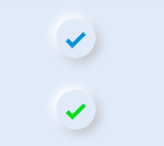

# Neumorphism

Neumorphism (aka neomorphism) is a relatively new design trend and a term that's gotten a good amount of buzz lately.
<p>It derives its name from skeuomorphism  – a way of integrating real-world objects into user interface design.</p>
Well in order to understand Neumorphism let's understand what is <b>Skeuomorphism</b> and <b>flat designs</b> first.
<br/>
<br/>
<p><a href="https://www.interaction-design.org/literature/topics/skeuomorphism"><b>Skeuomorphism</b></a> is a term used to define an interface that mimics real-world items. to cite you with an example it is like the 
recycle bin icon on the desktop screen and the dial icon on mobile phones. However these 3-dimensions looking elements started looking unnecessary and made the UI look cluttered and that's when the existence of Flat Design came into existence.</p>
<p><a href="https://www.interaction-design.org/literature/topics/flat-design"><b>Flat design</b></a> is a user interface design style that uses simple, two-dimensional elements and bright colors and it makes it feel like all the objects are lying on a Single Surface.</p>
<br/>
<P> In the below series of image it gives you an evolution of design starting from Skeuomorphism and then the flat designs and finally the Neumorphism.</p>
<br/>
<p>    </p>
<p>&nbsp;&nbsp;&nbsp;&nbsp;&nbsp;&nbsp;<b>Skeuomorphism</b>&nbsp;&nbsp;&nbsp;&nbsp;&nbsp;&nbsp;&nbsp;&nbsp;&nbsp;&nbsp;&nbsp;&nbsp;&nbsp;&nbsp;&nbsp;&nbsp;&nbsp;&nbsp;&nbsp;&nbsp;&nbsp;&nbsp;&nbsp;&nbsp;&nbsp;&nbsp;&nbsp;&nbsp;&nbsp;&nbsp;&nbsp;&nbsp;&nbsp;&nbsp;&nbsp;&nbsp;&nbsp;&nbsp;&nbsp;&nbsp;&nbsp;&nbsp;&nbsp;&nbsp;&nbsp;&nbsp;&nbsp;&nbsp;<b>Flat design</b>&nbsp;&nbsp;&nbsp;&nbsp;&nbsp;&nbsp;&nbsp;&nbsp;&nbsp;&nbsp;&nbsp;&nbsp;&nbsp;&nbsp;&nbsp;&nbsp;&nbsp;&nbsp;&nbsp;&nbsp;&nbsp;&nbsp;&nbsp;&nbsp;&nbsp;&nbsp;&nbsp;&nbsp;&nbsp;&nbsp;&nbsp;&nbsp;&nbsp;&nbsp;&nbsp;&nbsp;&nbsp;&nbsp;&nbsp;&nbsp;&nbsp;&nbsp;&nbsp;&nbsp;&nbsp;&nbsp;&nbsp;&nbsp;<b>Neumorphism</b></p>
<h2>Neumorphism</h2>
<br/>
<p>Neumorphic design draws from both skeuomorphism and flat design by pairing a monochromatic color palette with subtle shadows, while giving a sense of 3-dimensions in the form of buttons and other elements.</p>
<p> What makes it unique is the game of shadows and shades that Neumorphism uses to create very realistic buttons and objects. It gives the users a distinct feel. </p>
<br/>
<br/>
<p align="center"></p>
<h2> Benefits of Neumorphism</h2>
<ul>
  <li>It adds 3D feel for real buttons and Visual Freshness.</li>
  <li>Overloaded interfaces are bypassed by users.</li>
  <li>Neumorphism designs remain a timeless classic.</li>
  <li>It accelerates the process of conceptualizing, building, testing, and iterating new screens.</li>
</ul>

<p> This is the library reference <a href = "https://github.com/applibgroup/Neumorphism">Here</a> </p>

Similarly we can implement the below list of components.

| Components   | Display                                            |Description |
| -------------| -------------                                      |------------- |
| <b><a href ="https://github.com/applibgroup/Neumorphism/tree/main/entry/src/main/js/default/pages/node_modules/hmos-neumorphism/avatar">avatar</a></b>       |  &nbsp;&nbsp;&nbsp;&nbsp;&nbsp;&nbsp;&nbsp;&nbsp;&nbsp;&nbsp;&nbsp;&nbsp;&nbsp;&nbsp;&nbsp;&nbsp;&nbsp;&nbsp;&nbsp;&nbsp;&nbsp;&nbsp;&nbsp;&nbsp;&nbsp;&nbsp;&nbsp;&nbsp;&nbsp;&nbsp;&nbsp;&nbsp;&nbsp;&nbsp;&nbsp;&nbsp;&nbsp;&nbsp;&nbsp;&nbsp;&nbsp;&nbsp;&nbsp;&nbsp;&nbsp;&nbsp;&nbsp;&nbsp;  | Avatar is used to display the profile image with Neumorphism effect. We have access to the listed properties like icon, width, height and border and icon is the property used to add the image. More info can be found <a href="https://github.com/applibgroup/Neumorphism/tree/main/entry/src/main/js/default/pages/node_modules/hmos-neumorphism/avatar">here.</a>
| <b><a href="https://github.com/applibgroup/Neumorphism/tree/main/entry/src/main/js/default/pages/node_modules/hmos-neumorphism/button">button </a> </b>     |   |  Button is slightly different with  just not text but also has a icon prefixed and a onclick event which is triggered when the buttonis clicked.List of properties are icon, width, height and border and icon is the property to be used. More info can be found <a href="https://github.com/applibgroup/Neumorphism/tree/main/entry/src/main/js/default/pages/node_modules/hmos-neumorphism/button">here.</a>
| <b><a href="https://github.com/applibgroup/Neumorphism/tree/main/entry/src/main/js/default/pages/node_modules/hmos-neumorphism/buttons">buttons </a></b>     |   |Buttons is unique with slots on the left and right to add text, onclick event which is triggered when the buttonis clicked.List of properties are icon, width, height and slotto be used. More info can be found <a href="https://github.com/applibgroup/Neumorphism/tree/main/entry/src/main/js/default/pages/node_modules/hmos-neumorphism/buttons">here.</a>
| <b><a href="https://github.com/applibgroup/Neumorphism/tree/main/entry/src/main/js/default/pages/node_modules/hmos-neumorphism/checkbox">checkbox </a> </b>    |   | Checkbox is the simple checkbox option with Neumorphism effect and  more info can be found <a href="https://github.com/applibgroup/Neumorphism/blob/main/entry/src/main/js/default/pages/node_modules/hmos-neumorphism/checkbox/checkbox.hml">here.</a>
| <b><a href="https://github.com/applibgroup/Neumorphism/tree/main/entry/src/main/js/default/pages/node_modules/hmos-neumorphism/dropdown">dropdown</a> </b>    |   |Dropdown with Neumorphism effect with simple list items and  more info can be found <a href="https://github.com/applibgroup/Neumorphism/tree/main/entry/src/main/js/default/pages/node_modules/hmos-neumorphism/dropdown">here.</a>
| <b><a href= "https://github.com/applibgroup/Neumorphism/tree/main/entry/src/main/js/default/pages/node_modules/hmos-neumorphism/form">form </a>   </b>     |   |Form with Neumorphism effect is a unique component with text fields which is the neuinput component and more info can be found <a href="https://github.com/applibgroup/Neumorphism/tree/main/entry/src/main/js/default/pages/node_modules/hmos-neumorphism/form">here.</a>
| <b><a href="https://github.com/applibgroup/Neumorphism/tree/main/entry/src/main/js/default/pages/node_modules/hmos-neumorphism/input">input</a>  </b>      |   |Input with Neumorphism effect is a basic component for building forms with properties like type, maxlength and placeholder more info can be found <a href="https://github.com/applibgroup/Neumorphism/tree/main/entry/src/main/js/default/pages/node_modules/hmos-neumorphism/input">here.</a> 
| <b><a href="https://github.com/applibgroup/Neumorphism/tree/main/entry/src/main/js/default/pages/node_modules/hmos-neumorphism/label">label</a> </b>       |   |Label can be used with Input in which youy can add the icon and the text, more info can be found <a href="https://github.com/applibgroup/Neumorphism/tree/main/entry/src/main/js/default/pages/node_modules/hmos-neumorphism/label">here.</a> 
| <b><a href="https://github.com/applibgroup/Neumorphism/tree/main/entry/src/main/js/default/pages/node_modules/hmos-neumorphism/navbar">navbar</a>  </b>     |   |Navbar is a very intersting component that will help you to display 3 icon format with slots, more info can be found <a href="https://github.com/applibgroup/Neumorphism/tree/main/entry/src/main/js/default/pages/node_modules/hmos-neumorphism/navbar">here.</a> 
| <b><a href="https://github.com/applibgroup/Neumorphism/tree/main/entry/src/main/js/default/pages/node_modules/hmos-neumorphism/pagination">pagination</a> </b>  |   |Pagination with Neumorphism style and every page is a button , more info can be found <a href="https://github.com/applibgroup/Neumorphism/tree/main/entry/src/main/js/default/pages/node_modules/hmos-neumorphism/pagination">here.</a>        
| <b><a href="https://github.com/applibgroup/Neumorphism/tree/main/entry/src/main/js/default/pages/node_modules/hmos-neumorphism/progress">progress </a> </b>   |   |Progress which indicates the progress of particular action item with progress properties and color can provided to highlight the indicator, more info can be found <a href="https://github.com/applibgroup/Neumorphism/tree/main/entry/src/main/js/default/pages/node_modules/hmos-neumorphism/progress">here.</a> 
| <b><a href="https://github.com/applibgroup/Neumorphism/tree/main/entry/src/main/js/default/pages/node_modules/hmos-neumorphism/radio">radio  </a>  </b>    |   |Radio which is like checkbox simple as such in which you can perform two operation slike on or off, more info can be found <a href="https://github.com/applibgroup/Neumorphism/tree/main/entry/src/main/js/default/pages/node_modules/hmos-neumorphism/radio">here.</a>               
| <b><a href="https://github.com/applibgroup/Neumorphism/tree/main/entry/src/main/js/default/pages/node_modules/hmos-neumorphism/switcher">switcher</a></b>     |   |Switcher is more like a switcher which is like you want to turn on or turn off actions, more info can be found <a href="https://github.com/applibgroup/Neumorphism/tree/main/entry/src/main/js/default/pages/node_modules/hmos-neumorphism/switcher">here.</a>

<hr />
<p> Let’s go through some of the uses cases and there implementation using Neumorphism library.<p>
<h3>Smart Watch</h3>
<p> The complete uses cases code can be found <a href="https://github.com/applibgroup/Neumorphism_Smart_Watch">here.</a></p>
<p> The below uses cases is a simple Smartwatch implemented using the Neumorphism library and every component displayed in the smartwatch are the neumorphic component like listed below.</p>
<ul>
  <li>neutheme</li>
  <li>neubutton</li>
  <li>neucard </li>
 </ul>
<br/>
<br/>
<p float="left" >   </p>

<p> In order to display a simple card with title, subject and  message, below is the code snippet used. </p>

Usage:
```html
<neucard if="{{notifications}}" class="footer">
            <neubutton class="footer_icon">
                <image src="common/images/snooze.png"></image>
            </neubutton>
            <div class="footer_info semi_bold dark_text">
                <div class="footer_title">
                    <text>{{notification_title}}</text>
                </div>
                <div class="footer_subject">
                    <text>{{notification_subject}}</text>
                </div>
                <div class="message">
                    <text>{{notification_message}}</text>
                </div>
            </div>
        </neucard>
```

<p>With the above snippet we can get the below design.</p>

 <hr/>
 
<h3>Smart Home Dark and Light Theme</h3>
<p> The complete uses case code can be found <a href="https://github.com/applibgroup/Neumorphism_Smarthome_Darkmode">here.</a></p>
<p> The below uses case is a simple Living Room Design in <a href="https://github.com/applibgroup/Neumorphism_Smarthome_Darkmode">Dark mode </a> and <a href="https://github.com/applibgroup/Neumorphism_Smarthome_Lightmode">Light mode</a> and it is implemented using the Neumorphism library and every component displayed in the Living Room are the neumorphic component like listed below.</p>
<ul>
  <li>neutheme</li>
  <li>neucard </li>
  <li>swiper  </li>
 </ul>
<br/>
<br/>
<p float="left" >
&nbsp;&nbsp;&nbsp;&nbsp;&nbsp;&nbsp;&nbsp;&nbsp;&nbsp;&nbsp;</p>
<p> In order to display a simple ring progress bar with plus and minus icons to increase the temperature, below is the code snippet used. </p>

Usage:
```html
 <div class="controller">
                            <div class="minus semi_bold light_text">
                                <text>.05&deg;C</text>
                                <neubutton class="minus_button theme_bg" @button-event="decreaseTemp">
                                        <text>-</text>
                                </neubutton>
                            </div>
                            <div class="level semi_bold light_text">
                                <text>10&deg;C</text>
                                <div class="range">
                                    <div class="curve_bg">
                                        <div class="progress">
                                            <progress class="progress_bar theme_text" type="ring" percent="{{(temperature-15)*6}}"></progress>
                                            <div class="progress_value">
                                                <div class="progress_value_header semi_bold dark_text">
                                                    <text>{{temperature}}&deg;C</text>
                                                </div>
                                                <div class="progress_value_footer regular light_text">
                                                    <text>Celcius</text>
                                                </div>
                                            </div>
                                        </div>
                                    </div>
                                </div>
                            </div>
                            <div class="plus semi_bold light_text">
                                <text>.25&deg;C</text>
                                <neubutton class="plus_button theme_bg" @button-event="increaseTemp">
                                        <text>+</text>
                                </neubutton>
                            </div>
                        </div>
```

<p>With the above snippet we can get the below design.</p>

 <hr/>
 
<h3>Smart Home Light and Dark Theme Phone Mode</h3>
<p> The complete use case code can be found <a href="https://github.com/applibgroup/Neumorphism_Smarthome_Lightmode">here.</a></p>
<p> Like the above Living room design we have the same Design in phone mode for <a href="https://github.com/applibgroup/Neumorphism_Smarthome_Lightmode"> Light mode </a> and <a href="https://github.com/applibgroup/Neumorphism_Smarthome_Darkmode">Dark Mode</a> and it is implemented using the Neumorphism library and every component displayed in the Living Room are the neumorphic components.</p>
<br/>
<br/>
  <p float="left" >
&nbsp;&nbsp;&nbsp;&nbsp;&nbsp;&nbsp;&nbsp;&nbsp;&nbsp;&nbsp;&nbsp;&nbsp;&nbsp;&nbsp;&nbsp;&nbsp;&nbsp;&nbsp;&nbsp;&nbsp;&nbsp;&nbsp;&nbsp;&nbsp;&nbsp;

</p>
<hr />

<p>Below are the components created with Neumorphic effect </p>

# Alert
Alert components use to notify user of information
Let's see how to create the alert component in HarmonyOS.

1. Import: the node component and you can refer that from library <a href ="https://github.com/applibgroup/Neumorphism/blob/main/entry/src/main/js/default/pages/node_modules/hmos-neumorphism/alert/alert.hml"> here </a> as shown below. 

```html
<element name='neualert' src='../../../../../../alert.hml'></element>
```
2. Now we need use the tag named "neualert" and define the parameters like icon and Text as shown below.
  
Usage:
```html
<neualert icon="common/icons/heart.png" width="300px" height="60px" border="40px" >
     <text>Alert</text>
</neualert>
<neualert icon="common/icons/user.png" width="300px" height="60px" border="40px" >
     <text>Profile</text>
</neualert>
```
 Below are list of properties available.
  * `icon`
  * `width, height`
  * `border`
  
That's it by doing this we will get the below Neumorphic alert design and some variations.


<hr>

# Avatar
Avatar components use to notify user of information

Let's see how to create the Avatar component in HarmonyOS.

1. Import: the node component and you can refer that from library <a href ="https://github.com/applibgroup/Neumorphism/tree/main/entry/src/main/js/default/pages/node_modules/hmos-neumorphism/avatar"> here </a> as shown below. 

```html
<element name='neuavatar' src='../../../../../../avatar.hml'></element>
```

2. Now we need use the tag named "neuavatar" and define the parameters like icon shown below.
  
Usage:
```html
<neuavatar icon="common/icons/user.png" width="100px" height="100px" border="50px"></neuavatar>
```
Below are list of properties available.
  * `icon`
  * `width, height`
  * `border`
  
That's it by doing this we will get the below Neumorphic avatar design.


<hr>

# Button
Button components use to notify user of information

Let's see how to create the button component in HarmonyOS.

1. Import: the node component and you can refer that from library <a href ="https://github.com/applibgroup/Neumorphism/tree/main/entry/src/main/js/default/pages/node_modules/hmos-neumorphism/button"> here </a> as shown below. 

```html
<element name='neubutton' src='../../../../../../button.hml'></element>
```

2. Now we need use the tag named "neubutton" and define the parameters like icon and Text as shown below.
  
Usage:
```html
<neubutton icon="common/icons/heart.png" width="250px" height="60px" border="50px" onclick="buttonClick">
    <text>Button</text>
</neubutton>

<neubutton icon="common/icons/home.png" width="250px" height="60px" border="50px" onclick="buttonClick">
    <text>Home</text>
</neubutton>
```
Below are list of properties available.
  * `icon`
  * `width, height`
  * `border`
  * `button-event`

That's it by doing this we will get the below Neumorphic Button design.


<hr>

# Buttons
Buttons components use to notify user of information

Let's see how to create the buttons component in HarmonyOS.

1. Import: the node component and you can refer that from library <a href ="https://github.com/applibgroup/Neumorphism/tree/main/entry/src/main/js/default/pages/node_modules/hmos-neumorphism/buttons"> here </a> as shown below. 

```html
<element name='neubuttons' src='../../../../../../buttons.hml'></element>
```

2. Now we need use the tag named "neubuttons" and define the parameters like slots and onclick as shown below.
  
Usage:
```html
<neubuttons  width="250px" height="60px" border="50px">
    <button slot="first">Left</button>
    <button slot="second">Right</button>
</neubuttons>

<neubuttons  width="250px" height="60px" border="50px">
    <button slot="first">On</button>
    <button slot="second">Off</button>
</neubuttons>
```
Below are list of properties available.
  * `icon`
  * `width, height`
  * `border`
  * `slot`

That's it by doing this we will get the below Neumorphic buttons design.


<hr>

# Card
Now let's how to implement a card design.

1. Import: the node component and you can refer that from library <a href ="https://github.com/applibgroup/Neumorphism/blob/main/entry/src/main/js/default/pages/node_modules/hmos-neumorphism/card/card.hml"> here </a> as shown below. 

Import:
```html
<element name='neucard' src='../../../../../../card.hml'></element>
```

2. Now we need use the tag named "neucard" and define the parameters like height, width and border as shown below and a image to display inside the card, you can replace it with text as well.
  
Usage:
```html
<neucard width="300px" height="200px" border="10px" >
  <image src="common/placeholder.png" ></image>
</neucard>
```
Below are list of properties available.
  * `width, height`
  * `border`
  * `image src`
  
That's it by doing this we will get the below Neumorphic card design.


<hr/>

# Checkbox
Checkbox components use to notify user of information

Let's see how to create the checkbox component in HarmonyOS.

1. Import: the node component and you can refer that from library <a href ="https://github.com/applibgroup/Neumorphism/tree/main/entry/src/main/js/default/pages/node_modules/hmos-neumorphism/checkbox"> here </a> as shown below. 

```html
<element name='neucheckbox' src='../../../../../../checkbox.hml'></element>
```

2. Now we need use the tag named "neucheckbox" and define the parameters like color, width, height, check-event as shown below.
  
Usage:
```html
<neucheckbox color="#0092df" width="50px" height="50px" border="50px" checked="true" @check-event="checkboxClick"></neucheckbox>
<neucheckbox color="#00dd19" width="50px" height="50px" border="50px" checked="true" @check-event="checkboxClick"></neucheckbox>
```
Below are list of properties available.
  * `width, height`
  * `border`
  * `color`
  * `check-event`
  
That's it by doing this we will get the below Neumorphic checkbox design.


<hr>

# Dropdown
Dropdown components use to notify user of information

Let's see how to create the dropdown component in HarmonyOS.

1. Import: the node component and you can refer that from library <a href ="https://github.com/applibgroup/Neumorphism/tree/main/entry/src/main/js/default/pages/node_modules/hmos-neumorphism/dropdown"> here </a> as shown below. 

```html
<element name='neudropdown' src='../../../../../../dropdown.hml'></element>
```
2. Now we need use the tag named "neudropdown" and define the parameters like change-event option value as shown below.
  
Usage:
```html
<neudropdown width="200px" height="50px" border="10px" @change-event="dropdownSelect">
      <select @change="dropdownSelect">
          <option value="Item 1">Item 1</option>
          <option value="Item 2">Item 2</option>
          <option value="Item 3">Item 3</option>
          <option value="Item 4">Item 4</option>
          <option value="Item 5" selected="true">Item 5</option>
      </select>
  </neudropdown>

  <neudropdown width="200px" height="50px" border="10px" @change-event="dropdownSelect">
      <select @change="dropdownSelect">
          <option value="Item 1">Bangalore</option>
          <option value="Item 2">Chicago</option>
          <option value="Item 3">Toronto</option>
          <option value="Item 4">Orlando</option>
          <option value="Item 5" selected="true">Select a City</option>
      </select>
  </neudropdown>
```
Below are list of properties available.
  * `width, height`
  * `border`
  * `change-event`
  
That's it by doing this we will get the below Neumorphic dropdown design.

&nbsp;&nbsp;&nbsp;&nbsp;&nbsp;&nbsp;&nbsp;&nbsp;&nbsp;
<hr>

# Form
Form components use to notify user of information

Let's see how to create the form component in HarmonyOS.

1.Import: the node component and you can refer that from library <a href ="https://github.com/applibgroup/Neumorphism/tree/main/entry/src/main/js/default/pages/node_modules/hmos-neumorphism/form"> here </a> as shown below. 

```html
<element name='neuform' src='../../../../../../form.hml'></element>
```
2. Now we need use the tag named "neuform" and define the parameters like neuinput,neubutton, input type and so on as shown below.
  
Usage:
```html
<neuform width="350px" height="300px" border="20px" @submit-event="buttonClick" @reset-event="buttonClick">
 <neuinput icon="common/icons/user.png" type="email" maxlength="20" placeholder="Email" border="30px"></neuinput>
 <neuinput icon="" type="password" maxlength="20" placeholder="Password" border="20px"></neuinput>
 <div>
  <neubutton icon="" width="150px" border="20px">
   <input type='submit' style="border-radius:20px;">Submit</input>
  </neubutton>
  <neubutton icon="" width="150px" border="20px">
   <input type='reset' style="border-radius:20px;">Reset</input>
  </neubutton>
 </div>
</neuform>
```
Below are list of properties available.
  * `width, height`
  * `border`
  * `submit-event`,`reset-event`
  
That's it by doing this we will get the below Neumorphic form design.


<hr>

# Input
Input components use to notify user of information

Let's see how to create the input component in HarmonyOS.

1. Import: the node component and you can refer that from library <a href ="https://github.com/applibgroup/Neumorphism/tree/main/entry/src/main/js/default/pages/node_modules/hmos-neumorphism/input"> here </a> as shown below. 

```html
<element name='neualert' src='../../../../../../input.hml'></element>
```
2. Now we need use the tag named "neualert" and define the parameters like icon, type, placeholder as shown below.
  
Usage:
```html
<neuinput icon="common/icons/user.png" type="text" maxlength="20" placeholder="Input" width="300px" height="50px" border="50px" ></neuinput>
```
Below are list of properties available.
  * `width, height`
  * `icon`
  * `type`,`maxlength`
  * `placeholder`
  
That's it by doing this we will get the below Neumorphic input design.


<hr>

# Label
Label components use to notify user of information

Let's see how to create the label component in HarmonyOS.

1. Import: the node component and you can refer that from library <a href ="https://github.com/applibgroup/Neumorphism/tree/main/entry/src/main/js/default/pages/node_modules/hmos-neumorphism/label"> here </a> as shown below. 

```html
<element name='neulabel' src='../../../../../../label.hml'></element>
```

2. Now we need use the tag named "neulabel" and define the parameters like icon and text as shown below.
  
Usage:
```html
<neulabel text="Label" icon="common/icons/heart.png" width="200px" height="50px" border="50px" ></neulabel>

```
Below are list of properties available.
  * `width, height`
  * `icon`
  * `text`
  
That's it by doing this we will get the below Neumorphic label design.


<hr>

# Navbar
Navbar components use to notify user of information

Let's see how to create the navbar component in HarmonyOS.

1. Import: the node component and you can refer that from library <a href ="https://github.com/applibgroup/Neumorphism/tree/main/entry/src/main/js/default/pages/node_modules/hmos-neumorphism/navbar"> here </a> as shown below. 

```html
<element name='neunavbar' src='../../../../../../navbar.hml'></element>
```

2.Now we need use the tag named "neunavbar" and define the parameters like image and text as shown below.
  
Usage:
```html
<neulabel text="Label" icon="common/icons/heart.png" width="200px" height="50px" border="50px" ></neulabel>

  <neunavbar  width="300px" height="50px" border="50px" @right-event="buttonClick" @middle-event="buttonClick" @left-event="buttonClick">
      <image slot="first" src="common/icons/recent.png" style="width:20px; height: 20px;" ></image>
      <image slot="second" src="common/icons/home.png" style="width:20px; height: 20px;" ></image>
      <image slot="third" src="common/icons/return.png" style="width:20px; height: 20px;" ></image>
  </neunavbar>

  <neunavbar  width="300px" height="50px" border="50px" @right-event="buttonClick" @middle-event="buttonClick" @left-event="buttonClick">
      <text slot="first" style="color: #ea7979;" >Home</text>
      <text slot="second" style="color: #ea7979;" >Profile</text>
      <text slot="third" style="color: #ea7979;" >Settings</text>
  </neunavbar>

```
Below are list of properties available.
  * `width, height`
  * `right-event`
  * `middle-event`
  * `left-event`
  
That's it by doing this we will get the below Neumorphic navbar design.


<hr>

# Pagination
Pagination components use to notify user of information

Let's see how to create the pagination component in HarmonyOS.

1. Import: the node component and you can refer that from library <a href ="https://github.com/applibgroup/Neumorphism/tree/main/entry/src/main/js/default/pages/node_modules/hmos-neumorphism/pagination"> here </a> as shown below. 

```html
<element name='neupagination' src='../../../../../../pagination.hml'></element>
```
2. Now we need use the tag named "neupagination" and define the parameters like color,next-event and previous-event as shown below.
  
Usage:
```html
<neupagination color="" width="300px" height="50px" border="50px"  @previous-event="previousEvent" @next-event="nextEvent">
    <button>1</button>
    <button>2</button>
    <button>3</button>
    <button>4</button>
    <button>5</button>
</neupagination>

<neupagination color="#0092df" width="300px" height="50px" border="50px"  @previous-event="previousEvent" @next-event="nextEvent">
    <button>1</button>
    <button>2</button>
    <button>3</button>
    <button>4</button>
    <button>5</button>
</neupagination>
```
Below are list of properties available.
  * `width, height`
  * `color`
  * `previous-event`
  * `next-event`
  
That's it by doing this we will get the below Neumorphic pagination design.


<hr>

# Progress
Progress components use to notify user of information

Let's see how to create the Progress component in HarmonyOS.

1. Import: the node component and you can refer that from library <a href ="https://github.com/applibgroup/Neumorphism/tree/main/entry/src/main/js/default/pages/node_modules/hmos-neumorphism/progress"> here </a> as shown below. 

```html
<element name='neuprogress' src='../../../../../../progress.hml'></element>
```
2. Now we need use the tag named "neuprogress" and define the parameters like progress value as shown below.
  
Usage:
```html
    <neuprogress progress="80%" width="300px" color="" height="20px" border="50px"></neuprogress>
    <neuprogress progress="20%" width="300px" color="#04ff00" height="20px" border="50px"></neuprogress>
    <neuprogress progress="60%" width="300px" color="#ff0000" height="20px" border="50px"></neuprogress>
```
Below are list of properties available.
  * `progress`
  * `width`
  * `color`
  * `height, border`
  
That's it by doing this we will get the below Neumorphic Progress design.


<hr>

# Radio
Radio components use to notify user of information

Let's see how to create the radio component in HarmonyOS.

1. Import: the node component and you can refer that from library <a href ="https://github.com/applibgroup/Neumorphism/tree/main/entry/src/main/js/default/pages/node_modules/hmos-neumorphism/radio"> here </a> as shown below. 

```html
<element name='neuradio' src='../../../../../../radio.hml'></element>
```

2. Now we need use the tag named "neuradio" and define the parameters like color, width and check-event as shown below.
  
Usage:
```html
    <neuradio width="50px" color="" height="50px" border="50px" checked="true" @check-event="radioClick"></neuradio>
    <neuradio width="50px" color="#0092df" height="50px" border="50px" checked="true" @check-event="radioClick"></neuradio>
    <neuradio width="50px" color="#00dd19" height="50px" border="50px" checked="true" @check-event="radioClick"></neuradio>
```
Below are list of properties available.
  * `border`
  * `width height`
  * `color`
  * `check-event`
  
That's it by doing this we will get the below Neumorphic radio design.


<hr>

# Switcher
Switcher components use to notify user of information

Let's see how to create the Switcher component in HarmonyOS.

1.Import: the node component and you can refer that from library <a href ="https://github.com/applibgroup/Neumorphism/tree/main/entry/src/main/js/default/pages/node_modules/hmos-neumorphism/switcher"> here </a> as shown below. 

```html
<element name='neuswitcher' src='../../../../../../switcher.hml'></element>
```
2. Now we need use the tag named "neumorph_switcher" and define the parameters like color, toggle, toggle-event as shown below.
  
Usage:
```html
    <neuswitcher width="60px" color="#0092df" height="30px" border="50px" toggle="off" @toggle-event="toggleClick"></neuswitcher>
    <neuswitcher width="60px" color="#00dd19" height="30px" border="50px" toggle="on" @toggle-event="toggleClick"></neuswitcher>
    <neuswitcher width="60px" color="" height="30px" border="50px" toggle="off" @toggle-event="toggleClick"></neuswitcher>
```
Below are list of properties available.
  * `border`
  * `width height`
  * `toggle`
  * `toggle-event`
  * 
That's it by doing this we will get the below Neumorphic Switcher design.


<hr>


<p> You can find the component implementation on HarmonyOS <a href ="https://github.com/applibgroup/Neumorphism"> here.</a>
<p> If you haven't tried this unique style of designing then give it a try. With that being said, designers have been coming up with new design ideas that expand on the concept of Neumorphism every day. I am excited to see the interesting components that you can create.</p>
