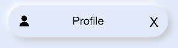

# Neumorphism

Neumorphism (aka neomorphism) is a relatively new design trend and a term that's gotten a good amount of buzz lately.
<p>It derives its name from skeuomorphism  – a way of integrating real-world objects into user interface design.</p>
<br/>
Well in order to understand Neumorphism we need understand what is <b>Skeuomorphism</b> and <b>flat designs</b> 
<br/>
<P> In the below series of image it gives you an evolution of design starting from Skeuomorphism and then the flat designs and finally the Neumorphism.</p>
<br/>
<p>        </p>
<p>&nbsp;&nbsp;&nbsp;&nbsp;&nbsp;&nbsp;<b>Skeuomorphism</b>&nbsp;&nbsp;&nbsp;&nbsp;&nbsp;&nbsp;&nbsp;&nbsp;&nbsp;&nbsp;&nbsp;&nbsp;&nbsp;&nbsp;&nbsp;&nbsp;&nbsp;&nbsp;&nbsp;&nbsp;&nbsp;&nbsp;&nbsp;&nbsp;&nbsp;&nbsp;&nbsp;&nbsp;&nbsp;&nbsp;&nbsp;&nbsp;&nbsp;&nbsp;&nbsp;&nbsp;&nbsp;&nbsp;&nbsp;&nbsp;&nbsp;&nbsp;&nbsp;&nbsp;&nbsp;&nbsp;&nbsp;&nbsp;<b>Flat design</b>&nbsp;&nbsp;&nbsp;&nbsp;&nbsp;&nbsp;&nbsp;&nbsp;&nbsp;&nbsp;&nbsp;&nbsp;&nbsp;&nbsp;&nbsp;&nbsp;&nbsp;&nbsp;&nbsp;&nbsp;&nbsp;&nbsp;&nbsp;&nbsp;&nbsp;&nbsp;&nbsp;&nbsp;&nbsp;&nbsp;&nbsp;&nbsp;&nbsp;&nbsp;&nbsp;&nbsp;&nbsp;&nbsp;&nbsp;&nbsp;&nbsp;&nbsp;&nbsp;&nbsp;&nbsp;&nbsp;&nbsp;&nbsp;<b>Neumorphism</b></p>
<h2>Skeuomorphism</h2>
<br/>
Skeuomorphism is a term used to define an interface that mimics real-world items. to cite you with an example it is like the 
recycle bin icon on the desktop screen and the dial icon on mobile phones. However these 3-dimensions looking elements started looking unnecessary and made the UI look cluttered and that's when the existence of Flat Design came into existence.
<br/>
<br/>
<p align="center"></p>
<h2>Flat Design</h2>
<p>Flat design is a user interface design style that uses simple, two-dimensional elements and bright colors and it makes it feel like all the objects are lying on a Single Surface.</p>
<br/>
<br/>
<p align="center"></p>
<br/>
<br/>
<h2>Neumorphism</h2>
<br/>
<p>Neumorphic design draws from both skeuomorphism and flat design by pairing a monochromatic color palette with subtle shadows, while giving a sense of 3-dimensions in the form of buttons and other elements.</p>
<p> What makes it unique is the game of shadows and shades that Neumorphism uses to create very realistic buttons and objects. It gives the users a distinct feel. </p>
<br/>
<br/>
<p align="center"></p>
<h2> Benefits of Neumorphism</h2>
<ul>
  <li>It adds 3D feel for real buttons and Visual Freshness.</li>
  <li>Overloaded interfaces are bypassed by users.</li>
  <li>Neumorphism designs remain a timeless classic.</li>
  <li>It accelerates the process of conceptualizing, building, testing, and iterating new screens.</li>
</ul>

<p> This is the library reference <a href = "https://github.com/applibgroup/Neumorphism">Here</a> </p>

Similarly we can implement the below list of components.

| Components   | Display                                            |Properties |
| -------------| -------------                                      |------------- |
| <b><a href ="https://github.com/applibgroup/Neumorphism/tree/main/entry/src/main/js/default/pages/node_modules/hmos-neumorphism/avatar">avatar</a></b>       |   |icon, width,height,border
| <b><a href="https://github.com/applibgroup/Neumorphism/tree/main/entry/src/main/js/default/pages/node_modules/hmos-neumorphism/button">button </a> </b>     |   |  icon, width,height,border, buttonevent
| <b><a href="https://github.com/applibgroup/Neumorphism/tree/main/entry/src/main/js/default/pages/node_modules/hmos-neumorphism/buttons">buttons </a></b>     |   |width,height,border, slot
| <b><a href="https://github.com/applibgroup/Neumorphism/tree/main/entry/src/main/js/default/pages/node_modules/hmos-neumorphism/checkbox">checkbox </a> </b>    |   | checked,check-event,color 
| <b><a href="https://github.com/applibgroup/Neumorphism/tree/main/entry/src/main/js/default/pages/node_modules/hmos-neumorphism/dropdown">dropdown</a> </b>    |   |change-event
| <b><a href= "https://github.com/applibgroup/Neumorphism/tree/main/entry/src/main/js/default/pages/node_modules/hmos-neumorphism/form">form </a>   </b>     |   |submit-event,reset-event
| <b><a href="https://github.com/applibgroup/Neumorphism/tree/main/entry/src/main/js/default/pages/node_modules/hmos-neumorphism/input">input</a>  </b>      |   |icon , type, maxlength,placeholder 
| <b><a href="https://github.com/applibgroup/Neumorphism/tree/main/entry/src/main/js/default/pages/node_modules/hmos-neumorphism/label">label</a> </b>       |   |text,icon
| <b><a href="https://github.com/applibgroup/Neumorphism/tree/main/entry/src/main/js/default/pages/node_modules/hmos-neumorphism/navbar">navbar</a>  </b>     |   |left-event,middle-event,right-event
| <b><a href="https://github.com/applibgroup/Neumorphism/tree/main/entry/src/main/js/default/pages/node_modules/hmos-neumorphism/pagination">pagination</a> </b>  |   |color,previous-event,next-event        
| <b><a href="https://github.com/applibgroup/Neumorphism/tree/main/entry/src/main/js/default/pages/node_modules/hmos-neumorphism/progress">progress </a> </b>   |   |progress,width,color
| <b><a href="https://github.com/applibgroup/Neumorphism/tree/main/entry/src/main/js/default/pages/node_modules/hmos-neumorphism/radio">radio  </a>  </b>    |   |checked,check-event                    
| <b><a href="https://github.com/applibgroup/Neumorphism/tree/main/entry/src/main/js/default/pages/node_modules/hmos-neumorphism/switcher">switcher</a></b>     |   |toggle-event

<hr />
<p> Let’s go through some of the uses cases and there implementation using Neumorphism library.<p>
<h3>Smart Watch</h3>
<p> The complete uses cases code can be found <a href="https://github.com/applibgroup/Neumorphism_Smart_Watch">here.</a></p>
<p> The below uses cases is a simple Smartwatch implemented using the Neumorphism library and every component displayed in the smartwatch are the neumorphic component like listed below.</p>
<ul>
  <li>neutheme</li>
  <li>neubutton</li>
  <li>neucard </li>
 </ul>
<br/>
<br/>
<p float="left" >   </p>

<p> In order to display a simple card with title, subject and  message, below is the code snippet used. </p>

Usage:
```html
<neucard if="{{notifications}}" class="footer">
            <neubutton class="footer_icon">
                <image src="common/images/snooze.png"></image>
            </neubutton>
            <div class="footer_info semi_bold dark_text">
                <div class="footer_title">
                    <text>{{notification_title}}</text>
                </div>
                <div class="footer_subject">
                    <text>{{notification_subject}}</text>
                </div>
                <div class="message">
                    <text>{{notification_message}}</text>
                </div>
            </div>
        </neucard>
```

<p>With the above snippet we can get the below design.</p>

 <hr/>
 
<h3>Smart Home Dark Theme</h3>
<p> The complete uses case code can be found <a href="https://github.com/applibgroup/Neumorphism_Smarthome_Darkmode">here.</a></p>
<p> The below uses case is a simple Living Room Design in Dark mode and it is implemented using the Neumorphism library and every component displayed in the Living Room are the neumorphic component like listed below.</p>
<ul>
  <li>neutheme</li>
  <li>neucard </li>
  <li>swiper  </li>
 </ul>
<br/>
<br/>
<p float="left" >


<p> In order to display a simple ring progress bar with plus and minus icons to increase the temperature, below is the code snippet used. </p>

Usage:
```html
 <div class="controller">
                            <div class="minus semi_bold light_text">
                                <text>.05&deg;C</text>
                                <neubutton class="minus_button theme_bg" @button-event="decreaseTemp">
                                        <text>-</text>
                                </neubutton>
                            </div>
                            <div class="level semi_bold light_text">
                                <text>10&deg;C</text>
                                <div class="range">
                                    <div class="curve_bg">
                                        <div class="progress">
                                            <progress class="progress_bar theme_text" type="ring" percent="{{(temperature-15)*6}}"></progress>
                                            <div class="progress_value">
                                                <div class="progress_value_header semi_bold dark_text">
                                                    <text>{{temperature}}&deg;C</text>
                                                </div>
                                                <div class="progress_value_footer regular light_text">
                                                    <text>Celcius</text>
                                                </div>
                                            </div>
                                        </div>
                                    </div>
                                </div>
                            </div>
                            <div class="plus semi_bold light_text">
                                <text>.25&deg;C</text>
                                <neubutton class="plus_button theme_bg" @button-event="increaseTemp">
                                        <text>+</text>
                                </neubutton>
                            </div>
                        </div>
```

<p>With the above snippet we can get the below design.</p>

 <hr/>
 
<h3>Smart Home Light Theme</h3>
<p> The complete use case code can be found <a href="https://github.com/applibgroup/Neumorphism_Smarthome_Lightmode">here.</a></p>
<p> Like the above Living room design we have the same Design in Light mode and it is implemented using the Neumorphism library and every component displayed in the Living Room are the neumorphic components.</p>
<br/>
<br/>
<p float="left" >


</p>
<hr />

<p>Let's see some of the components created with Neumorphic effect </p>

# Alert
Alert components use to notify user of information

Let's see how to create the alert component in HarmonyOS.

<h3> Step 1</h3>
Import: the node component and you can refer that from library <a href ="https://github.com/applibgroup/Neumorphism/blob/main/entry/src/main/js/default/pages/node_modules/hmos-neumorphism/alert/alert.hml"> here </a> as shown below. 

```html
<element name='neualert' src='../../../../../../alert.hml'></element>
```
<h3> Step 2</h3>
<p> Now we need use the tag named "neualert" and define the parameters like icon and Text as shown below.
  
Usage:
```html
<neualert icon="/heart.png" width="300px" height="60px" border="40px" >
  <text>Alert !</text>
</neualert>
```
That's it by doing this we will get the below Neumorphic alert design.


<hr>

# Card
Now let's how to implement a card design.

<h3> Step 1</h3>
Import: the node component and you can refer that from library <a href ="https://github.com/applibgroup/Neumorphism/blob/main/entry/src/main/js/default/pages/node_modules/hmos-neumorphism/card/card.hml"> here </a> as shown below. 

Import:
```html
<element name='neucard' src='../../../../../../card.hml'></element>
```
<h3> Step 2</h3>
<p> Now we need use the tag named "neucard" and define the parameters like height, width and border as shown below and a image to display inside the card, you can replace it with text as well.
  
Usage:
```html
<neucard width="300px" height="200px" border="10px" >
  <image src="common/placeholder.png" ></image>
</neucard>
```
That's it by doing this we will get the below Neumorphic card design.


  <hr/>
<p> You can find the component implementation on HarmonyOS <a href ="https://github.com/applibgroup/Neumorphism"> here.</a>
<p> If you haven't tried this unique style of designing then give it a try. With that being said, designers have been coming up with new design ideas that expand on the concept of Neumorphism every day. I am excited to see the interesting components that you can create.</p>
