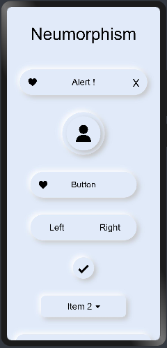

# Neumorphism


Neumorphism (aka neomorphism) is a relatively new design trend and a term that's gotten a good amount of buzz lately.
<p>It derives its name from skeumorphism – a way of integrating real-world objects into user interface design.</p>
<br/>
Well inorder to understand Neumorphism we need understand what is <b>Skeuomorphism</b> and <b>flat designs</b> 
<br/>
<P> In the below series of image it gives you a evolution of design starting from Skeuomorphism and then the flat designs and finally the Neumorphism.</p>
<br/>
<p>        </p>
<p>&nbsp;&nbsp;&nbsp;&nbsp;&nbsp;&nbsp;<b>Skeuomorphism</b>&nbsp;&nbsp;&nbsp;&nbsp;&nbsp;&nbsp;&nbsp;&nbsp;&nbsp;&nbsp;&nbsp;&nbsp;&nbsp;&nbsp;&nbsp;&nbsp;&nbsp;&nbsp;&nbsp;&nbsp;&nbsp;&nbsp;&nbsp;&nbsp;&nbsp;&nbsp;&nbsp;&nbsp;&nbsp;&nbsp;&nbsp;&nbsp;&nbsp;&nbsp;&nbsp;&nbsp;&nbsp;&nbsp;&nbsp;&nbsp;&nbsp;&nbsp;&nbsp;&nbsp;&nbsp;&nbsp;&nbsp;&nbsp;<b>Flat design</b>&nbsp;&nbsp;&nbsp;&nbsp;&nbsp;&nbsp;&nbsp;&nbsp;&nbsp;&nbsp;&nbsp;&nbsp;&nbsp;&nbsp;&nbsp;&nbsp;&nbsp;&nbsp;&nbsp;&nbsp;&nbsp;&nbsp;&nbsp;&nbsp;&nbsp;&nbsp;&nbsp;&nbsp;&nbsp;&nbsp;&nbsp;&nbsp;&nbsp;&nbsp;&nbsp;&nbsp;&nbsp;&nbsp;&nbsp;&nbsp;&nbsp;&nbsp;&nbsp;&nbsp;&nbsp;&nbsp;&nbsp;&nbsp;<b>Neumorphism</b></p>
<h2>Skeuomorphism</h2>
<br/>
Skeuomorphism is a term used to define an interface that mimics real-world items. to cite you with an example it is like the 
recycle bin icon on the desktop screen and the dial icon on mobile phones. However these 3-dimensions looking elements started looking unnecessary and made the UI look cluttered and that's when the existence of Flat Design came into existence.
<br/>
<br/>
<p align="center"></p>
<h2>Flat Design</h2>
<p>Flat design is a user interface design style that uses simple, two-dimensional elements and bright colors and it makes it feel like all the objects are lying on a Single Surface.</p>
<br/>
<br/>
<p align="center"></p>
<br/>
<br/>
<h2>Neumorphism</h2>
<br/>
<p>Neumorphic design draws from both skeumorphism and flat design by pairing a monochromatic color palette with subtle shadows, while giving a sense of 3-dimensions in the form of buttons and other elements.</p>
<p> what makes it unique is the game of shadows and shades that Neumorphism uses to create very realistic buttons and objects. It gives the users a distinct feel. </p>
<br/>
<br/>
<p align="center"></p>
<h2> Benefits of Neumorphism</h2>
<ul>
  <li>It adds 3D feel for real buttons and Visual Freshness.</li>
  <li>Overloaded interfaces are bypassed by users.</li>
  <li>Neumorphic designs remain a timeless classic.</li>
  <li>It accelerates the process of conceptualizing, building, testing, and iterating new screens.</li>
</ul>

<p> This is the library reference <a href = "https://github.com/applibgroup/Neumorphism">Here</a> </p>

<p>Let's see some of the components created with Neumorphic effect </p>

# Alert
Alert components use to notify user of information

Let's see how to create the alert component in HarmonyOS.

<h3> Step 1</h3>
Import: the node component and you can refer that from library <a href ="https://github.com/applibgroup/Neumorphism/blob/main/neumorphism/alert/alert.hml"> here </a> as shown below. 

```html
<element name='neualert' src='../../../../../../alert.hml'></element>
```
<h3> Step 2</h3>
<p> now we need use the tag named "neualert" and define the parameters like icon and Text as shown below.
  
Usage:
```html
<neualert icon="/heart.png" width="300px" height="60px" border="40px" >
  <text>Alert !</text>
</neualert>
```
That's it by doing this we will get the below Neumorphic alert design.


<hr>

# Card
Now let'se how to implement a card design.

<h3> Step 1</h3>
Import: the node component and you can refer that from library <a href ="https://github.com/applibgroup/Neumorphism/blob/main/neumorphism/card/card.hml"> here </a> as shown below. 

Import:
```html
<element name='neucard' src='../../../../../../card.hml'></element>
```
<h3> Step 2</h3>
<p> Now we need use the tag named "neucard" and define the parameters like height, width and border as shown below and a image to display inside the card, you can replace it with text as well.
  
Usage:
```html
<neucard width="300px" height="200px" border="10px" >
  <image src="common/placeholder.png" ></image>
</neucard>
```
That's it by doing this we will get the below Neumorphic card design.


  <hr/>
Similarly we can implement the below list of components.

| Components   | Display |
| -------------| ------------- |
| avatar       |   |
| button       |   |
| buttons      |   |
| checkbox     |   |
| dropdown     |   |
| form         |   |
| input        |   |
| label        |   |
| navbar       |   |
| pagination   |   |
| progress     |   |
| radio        |   |
| switcher     |   |

<hr />
<p> Lets go through some of the usescases and there implementation using Neumorphic library<p>
<h3>Smart Watch</h3>
<p></p>
<br/>
<br/>
<p float="left" ></p>
<h3>Smart Home Dark Theme</h3>
<p></p>
<br/>
<br/>
<p float="left" >


</p>
<h3>Smart Home Light Theme</h3>
<p></p>
<br/>
<br/>
<p float="left" >


</p>
<p> You can find the component implementation on HarmonyOS <a href ="https://github.com/applibgroup/Neumorphism"> here.</a>
<p> If you haven't tried this unique style of designing then give it a try. With that being said, designers have been coming up with new design ideas that expand on the concept of Neumorphism every day. I am excited to see the intersting components that you can create.</p>
